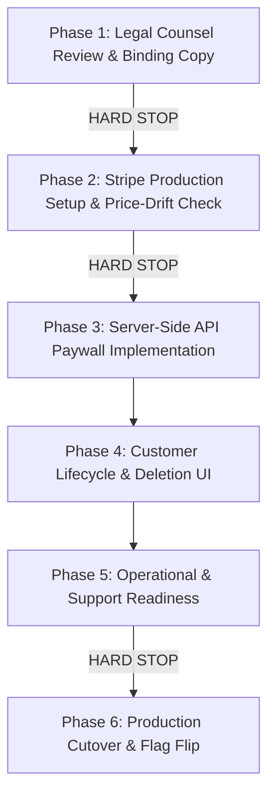

# MindMosaic Monetisation Go-Live Checklist

**Branch:** `docs/monetisation-readiness`  
**Status:** Ranked Roadmap & Go-Live Criteria  
**Date:** October 2026  
**Audience:** Repository Owner (Vish), Core Engineering, Legal Counsel  

---

## Overview

This checklist establishes the strict chronological order and verification gates required before MindMosaic can accept paid transactions and enforce subscription paywalls. 

Each phase represents a hard boundary. **Work must stop at every marked HARD STOP until human approval and counsel decisions are rendered.**



---

## Ranked Execution Phases

### Phase 1: Legal Counsel Review & Formal Policies (Priority: HIGHEST)
> [!CAUTION]
> **HARD STOP:** Never collect payments under draft legal documents or unreviewed privacy disclosures.

- [ ] **1.1 Legal Counsel Briefing:** Transmit `docs/legal/compliance-requirements.md` (including the 6 specific counsel questions) to Vish's Australian legal counsel.
- [ ] **1.2 Terms of Service Adoption:**
  - [ ] Receive binding Terms of Service from counsel.
  - [ ] Update `src/app/terms/page.tsx` with finalized terms.
  - [ ] Remove `DraftBanner` from `/terms`.
  - [ ] Verify ACL compliance regarding recurring billing, auto-renewals, and clear cancellation terms.
- [ ] **1.3 Privacy Policy & AU Children's Code Compliance:**
  - [ ] Receive finalized Privacy Policy from counsel.
  - [ ] Update `src/app/privacy/page.tsx` with formal policy.
  - [ ] Remove `DraftBanner` from `/privacy`.
  - [ ] Publish clear retention schedule and account closure process.
- [ ] **1.4 IP & Assessment Trademark Notices:**
  - [ ] Verify ACARA (NAPLAN) and Janison (ICAS) disclaimers are present on all marketing landing pages (`/practice/**`, `/programs/**`, `/assessment-disclaimer`).
  - [ ] Verify all UI labels read "NAPLAN-style" and "ICAS-style" with zero claim of official affiliation.

---

### Phase 2: Stripe Production Setup & Price-Drift Protection
> [!CAUTION]
> **HARD STOP:** Never launch checkout if Stripe amounts or currencies diverge from advertised amounts.

- [ ] **2.1 Production Stripe Setup:**
  - [ ] Configure live Stripe account under Australian entity.
  - [ ] Create Family Plan Products and Recurring Prices in Stripe Dashboard:
    - Monthly: `1499` AUD cents ($14.99 AUD inclusive of GST)
    - Annual: `14900` AUD cents ($149.00 AUD inclusive of GST)
  - [ ] Configure Stripe Tax to calculate and report Australian GST (10%).
- [ ] **2.2 Environment Variables Configuration:**
  - [ ] Set `STRIPE_SECRET_KEY` and `STRIPE_WEBHOOK_SECRET` in hosting provider (e.g. Vercel).
  - [ ] Set `STRIPE_PRICE_FAMILY_MONTHLY` and `STRIPE_PRICE_FAMILY_ANNUAL`.
  - [ ] Pinned check: `NEXT_PUBLIC_` prefix is strictly forbidden for secret keys.
- [ ] **2.3 Price-Drift Automated CI Check:**
  - [ ] Build script `scripts/billing/verify-stripe-prices.ts` per `docs/billing/paywall-enforcement-spec.md`.
  - [ ] Add `npm run check:prices` to CI build pipeline.
  - [ ] Verify that CI fails if Stripe unit amount, currency, interval, or tax behavior differs from `src/lib/billing/prices.ts`.

---

### Phase 3: Server-Side API Paywall Implementation
- [ ] **3.1 Central Server Helper Implementation:**
  - [ ] Create `src/features/billing/require-active-subscription-api.ts` per spec.
  - [ ] Write comprehensive unit tests in `src/tests/unit/require-active-subscription-api.test.ts`.
- [ ] **3.2 Endpoint Integration:**
  - [ ] Gate `POST /api/exam/session` (fail with 402 if student's linked parent has no active subscription).
  - [ ] Gate `POST /api/exam/session/[id]/submit` (fail with 402 if subscription lapsed).
  - [ ] Gate `src/features/auth/provision-child.ts` (`provisionChild` action checks parent entitlement + enforces 3-child maximum).
  - [ ] Gate `POST /api/student/onboarding/complete`.
- [ ] **3.3 In-Flight Session Fail-Soft Verification:**
  - [ ] Verify `POST /api/exam/session/[id]/responses` (autosave) remains unblocked mid-exam even if parent subscription expires during sitting.
- [ ] **3.4 Guest Flow Protection Verification:**
  - [ ] Verify `GET /api/exam/guest-bank` and `/practice/**` remain 100% accessible to unauthenticated guests.

---

### Phase 4: Customer Lifecycle & Deletion UI
- [ ] **4.1 Self-Service Account Closure:**
  - [ ] Build UI in `/billing` or `/parent` settings enabling a parent to cancel subscription and request account deletion.
  - [ ] Wire deletion request to call the existing `request_student_erasure` / GDPR erasure engine.
- [ ] **4.2 Child Unlink vs. Deletion Clarification:**
  - [ ] Update child management modal in `/parent/children` to clarify that removing a child unlinks them from dashboard, with an option to request permanent erasure.
- [ ] **4.3 Invoicing & Customer Portal:**
  - [ ] Verify self-service Stripe Customer Portal (`/api/stripe/portal`) allows parents to download official Australian GST tax invoices and update payment methods.

---

### Phase 5: Operational & Support Readiness
- [ ] **5.1 Support Channel Setup:**
  - [ ] Ensure `hello@mindmosaic.app` is actively monitored with clear escalation paths for billing disputes and refund requests.
- [ ] **5.2 Failed Payment (Dunning) Handling:**
  - [ ] Verify Stripe webhook correctly marks subscription `past_due` on failed payment.
  - [ ] Confirm database function `has_active_access` grants access during the Stripe dunning window.
  - [ ] Confirm access terminates once Stripe cancels the subscription after retries exhaust.

---

### Phase 6: Production Cutover & Flag Flip
> [!CAUTION]
> **HARD STOP:** Repository owner (Vish) sign-off required prior to production deployment.

- [ ] **6.1 Full Pre-Commit Verification Gate:**
  ```bash
  npm run typecheck
  npm run lint
  npm test
  npm run build
  npm run check:prices
  npm run validate:questions
  npm run check:answers -- --include-published
  npm run questions:validate-ledger
  npm run test:rls
  npm run test:e2e
  npm run test:e2e:auth
  ```
- [ ] **6.2 Flag Activation:**
  - [ ] In `src/lib/billing/prices.ts`: flip `FAMILY_PLAN_AVAILABILITY` from `"roadmap"` to `"purchasable"`.
  - [ ] In production environment: set `BILLING_ENFORCEMENT_ENABLED="true"`.
- [ ] **6.3 Smoke Testing in Production:**
  - [ ] Execute test purchase with test credit card in Stripe live mode (via 100% discount coupon).
  - [ ] Verify webhook receipt, subscription record creation, and child practice session start.
  - [ ] Verify test cancellation and invoice download.
