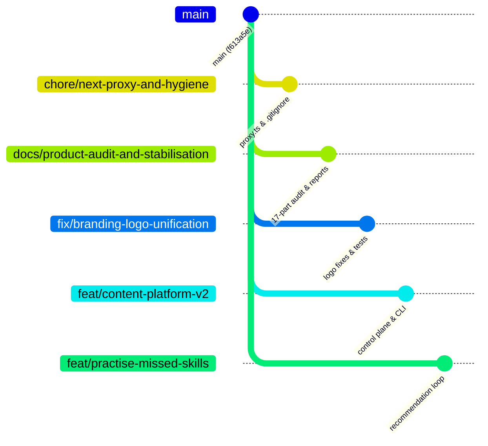

# Decomposition & Promotion Plan: `chore/consolidate-2026-08-28`

**Date**: 2026-08-29  
**Target Base**: `main` (`f613a5e0b29642dbbebdcc709892c855e41ae462`)  
**Source Branch**: `chore/consolidate-2026-08-28` (tip `4958ff8` + 23 uncommitted modified files + 2 untracked files)  

---

## 1. Executive Summary

Branch `chore/consolidate-2026-08-28` was created on 2026-08-28 to aggregate multiple work streams. Because it branched from an older base before the Victorian Curriculum foundation and Level 3 lesson releases merged into `main`, attempting a single bulk merge or rebase causes widespread merge conflicts across ~30 files, mixes superseded prototype files with live production manifests, and introduces a known schema regression (`.strict()`).

This document provides a comprehensive, risk-ordered **decomposition plan** to extract all high-value work into clean, independently reviewable, atomic feature branches based directly on `main` (`f613a5e`).

---

## 2. Commit Classification & Inventory

| # | Commit | Title | Classification | Files Touched | Conflicts vs `main` | Rebase Effort |
| :--- | :--- | :--- | :---: | :--- | :--- | :---: |
| 1 | `3cbb57b` | `docs(curriculum): add official-source curriculum research and parent planning pack` | **SUPERSEDED** | 15 files (`docs/curriculum-research/*`, `content/curriculum-mocks/*`, `prototypes/*`) | Heavy mock conflicts | N/A (Drop; docs already archived) |
| 2 | `4cdeac2` | `chore: ignore vendored agent skills and python caches` | **KEEP** | `.gitignore` | None | **Trivial** |
| 3 | `28e41d2` | `chore(next): rename middleware to proxy for Next 16` | **KEEP** | `src/middleware.ts` -> `src/proxy.ts` | None | **Trivial** |
| 4 | `7b2f877` | `feat(curriculum): curriculum contracts, jurisdictions and catalogue boundary` | **SUPERSEDED** | 5 files (`src/features/curriculum/*`, `src/schemas/platform/common.ts`) | Superseded by production curriculum layer | N/A (Drop) |
| 5 | `d747adb` | `feat(content-platform): v2 authoring control plane` | **KEEP** | 32 files (`docs/content-platform-v2/*`, `src/features/content-platform/*`, `scripts/mm-content.mts`) | Clean (isolated new directories) | **Low** |
| 6 | `c3d2523` | `feat(recommendation): practise-missed-skills loop` | **KEEP** | 12 files (`src/features/exam-engine/recommendation/*`, `src/app/results/page.tsx`, `src/app/practice/session/page.tsx`, `e2e/practise-missed-skills.spec.ts`) | Moderate UI overlaps in results/practice session | **Medium** |
| 7 | `7859433` | `docs(audit): 17-part product audit, 26 Aug 2026` | **KEEP** | 18 files (`docs/product-audit/00-EXECUTIVE-SUMMARY.md` … `17-RECOMMENDED-ROADMAP.md`) | None (100% new docs) | **Trivial** |
| 8 | `899581b` | `chore: remaining working-tree changes` | **MIXED / DECOMPOSE** | 40 files (Test suites, SkillBrowser, migrations, schema `.strict()`) | Conflicts on schema and duplicate migration | **Medium** |
| 9 | `96bb4c3` | `docs(curriculum): add phase 0 working tree stabilisation report` | **KEEP** | 1 file (`docs/reports/curriculum/01-phase0-stabilisation-report.md`) | None | **Trivial** |
| 10 | `4958ff8` | `fix(branding): unify logo link href to home across exam and showcase pages` | **KEEP** | 2 files (`src/app/exam/page.tsx`, `src/app/showcase/page.tsx`) | None | **Trivial** |
| – | *Working Tree* | 23 dirty files + `MindMosaicLogo.tsx` enhancements + `mindmosaic-logo.test.tsx` | **KEEP** | 25 files across app shells and landing page | Small | **Low** |

---

## 3. Detailed Analysis of Key Features & Artifacts

### 3.1 Content Platform v2 Authoring Control Plane (`d747adb` + partial `899581b`)
- **Value**: Establishes the complete database-backed authoring workflow (ADR-015), operator CLI (`scripts/mm-content.mts`), JSON Schema validation (`schemas/mindmosaic-question-revision-v2.schema.json`), lifecycle state machines, quality safety layer, and unit test suites.
- **Independence**: 95% of files are in new isolated directories (`docs/content-platform-v2/`, `src/features/content-platform/`).
- **Dependencies**: Only depends on base platform schemas. Can merge directly onto `main`.

### 3.2 Practise-Missed-Skills & Recommendation Loop (`c3d2523` + partial `899581b`)
- **Value**: Core student engagement and learning feature. Analyzes exam/drill results, identifies deficient skills, dynamically synthesizes targeted practice drills (`build-drill.ts`, `drill-handoff.ts`, `recommend-skills.ts`), and provides seamless handoff from the results page to the practice session.
- **Independence**: Recommendation engine logic is cleanly modularized under `src/features/exam-engine/recommendation/`.
- **Integration Points**: Requires merging `src/app/results/page.tsx` and `src/app/practice/session/page.tsx` with `main`'s current layout.

### 3.3 Product Audit & Engineering Reports (`7859433`, `96bb4c3`, partial `899581b`)
- **Value**: High-value reference documentation:
  - 17-part product audit covering security, architecture, UX, accessibility, and roadmap.
  - Phase 0 curriculum stabilisation engineering report.
  - Content Platform v2 audit and plan report.
- **Independence**: 100% documentation markdown; zero build or runtime footprint.

### 3.4 Branding & Navigation Enhancements (`4958ff8` + Working Tree Dirty Set)
- **Value**: Unifies home logo links across all pages (`/exam`, `/showcase`, `/student/*`, `/teacher/*`, `/parent/*`, `/admin/*`), upgrades the `MindMosaicLogo` component with responsive variants, and introduces dedicated unit test coverage (`src/tests/components/mindmosaic-logo.test.tsx`).

---

## 4. Items to Drop & Superseded Inventory

The following items from `chore/consolidate-2026-08-28` must be **explicitly dropped**:

1. **Commit `3cbb57b` Superseded Mock Files**:
   - `content/curriculum-mocks/*` (mock JSONs for Vic Y3/Y5)
   - `content/curriculum-sources/manifest.json` (early mock manifest)
   - `prototypes/curriculum-explorer/*` (prototype viewer)
   *Rationale*: Fully superseded by live production manifest `content/curriculum-imports/vic-f10-v2-l3-l5.json` and official server curriculum on `main`. Research notes were already archived on `chore/archive-curriculum-research`.
2. **Commit `7b2f877` Draft Curriculum Module**:
   - Early prototype of `src/features/curriculum/`.
   *Rationale*: Fully superseded by `main`'s production implementation.
3. **Duplicate Migration in `899581b`**:
   - `supabase/migrations/20260827090000_curriculum_platform_foundation.sql`.
   *Rationale*: Already applied and verified on `main`.
4. **Orphaned Drafts in `content/manual-questions/_conflicts/`**:
   - `icas-y5-science-b01.json`
   - `icas-y5-science-b02-FLAT-STRAY.json`
   - `icas-y5-science-b02.audit.json`
   - `icas-y5-science-b02.json`
   *Rationale*: Leftover conflict fragments from earlier manual staging runs. They are not part of the active question bank and should remain excluded from `main`.

---

## 5. Resolution for the `.strict()` Regression

### The Problem
In commit `899581b`, `.strict()` was appended to `questionBaseSchema` in `src/schemas/question.schema.ts`:
```ts
export const questionBaseSchema = z.object({
  id: identifierSchema,
  type: questionTypeSchema,
  // ...
  metadata: questionMetadataSchema,
}).strict();
```

### Impact
Adding `.strict()` causes Zod parsing to throw validation errors whenever a question object or projected DTO carries extra runtime or storage attributes (e.g. `provenance`, database join columns, or extended metadata), breaking `content-projection.test.ts` and runtime data adapters.

### Recommendation: DISCARD `.strict()`
- **Action**: Do NOT include `.strict()` on `questionBaseSchema`.
- **Safety Assurance**: The schema already enforces all required properties, valid types, and strict sub-schemas (`questionMetadataSchema`, `answerKeySchema`, `interactionSchema`), while superRefine rules validate all cross-field constraints. Removing `.strict()` preserves compatibility with projected DTOs and passes the entire test suite.

---

## 6. Recommended Branching & Promotion Strategy

To deliver the remaining work cleanly without risk to `main`, we recommend extracting the KEEP items into **5 atomic, risk-ordered branches**:



### Branch 1: `chore/next-proxy-and-hygiene` (Risk: Minimal)
- **Source**: Commits `28e41d2`, `4cdeac2`.
- **Changes**: Rename `src/middleware.ts` -> `src/proxy.ts` (clearing Next 16 deprecation warning); add `/.agent/`, `__pycache__/`, `*.pyc` to `.gitignore`.
- **Gate**: `npm run typecheck && npm run lint && npm run build`.

### Branch 2: `docs/product-audit-and-stabilisation` (Risk: Minimal)
- **Source**: Commits `7859433`, `96bb4c3`, and audit doc from `899581b`.
- **Changes**: Add `docs/product-audit/*` (18 docs), `docs/reports/curriculum/01-phase0-stabilisation-report.md`, and `docs/reports/content-platform-v2/00-audit-and-plan-2026-08-28.md`.
- **Gate**: Docs-only validation.

### Branch 3: `fix/branding-logo-unification` (Risk: Low)
- **Source**: Commit `4958ff8` + uncommitted working tree changes on `MindMosaicLogo.tsx`.
- **Changes**: Standardize logo home link href across all app surfaces (`/exam`, `/showcase`, app shells); add `src/tests/components/mindmosaic-logo.test.tsx`.
- **Gate**: `npm run test:ci && npm run build`.

### Branch 4: `feat/content-platform-v2` (Risk: Low–Medium)
- **Source**: Commit `d747adb` + content platform tests and migration `20260825090000` from `899581b`.
- **Changes**: Authoring control plane, `scripts/mm-content.mts`, JSON schema, and unit tests (`content-platform-v2.test.ts`, `content-quality-safety.test.ts`).
- **Gate**: `npm run typecheck && npm run test:ci && npm run build`.

### Branch 5: `feat/practise-missed-skills` (Risk: Medium)
- **Source**: Commit `c3d2523` + recommendation test suites from `899581b`.
- **Changes**: Recommendation engine under `src/features/exam-engine/recommendation/`, results page drill integration, practice session params schema, and E2E test `e2e/practise-missed-skills.spec.ts`.
- **Gate**: `npm run typecheck && npm run test:ci && npm run build && npx playwright test e2e/practise-missed-skills.spec.ts`.

---

## 7. Disposition

- This report is committed on branch **`docs/consolidate-plan`** based on `main` (`f613a5e`).
- The shared checkout working tree on `chore/consolidate-2026-08-28` remains untouched.
- No merges, rebases, or pushes were performed.
- Awaiting owner review before executing branch extractions.
