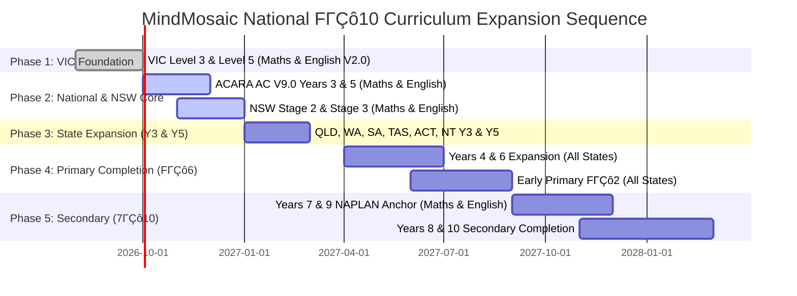

# All-FΓÇô10 National Curriculum Expansion Sequence

**Document ID:** `DOC-CURR-005`  
**Effective Date / Version:** 28 August 2026 / Version 2.0 (Hardened)  
**Author:** Antigravity (Curriculum Research & Planning Pack)  
**Target Repository Branch:** `gemini/curriculum-catalogue-planning`  
**Scope:** Phased National Rollout across Foundation/Transition to Year 10 (F/TΓÇô10) across all Australian States and Territories.

---

## 1. Expansion Strategy & Quality Gates

MindMosaicΓÇÖs curriculum catalogue expansion is governed by strict pedagogical and capacity gates:

1. **Diagnostic Anchors (Years 3 and 5):** Establish comprehensive baseline coverage for Primary NAPLAN testing cohorts across all Australian jurisdictions before expanding to other year levels.
2. **Core Literacy and Numeracy First:** Mathematics and English are prioritised across all sectors (Government, Catholic, Independent).
3. **Sector Evidence Requirements:** Catholic and Independent sector curriculum timelines are treated as unverified until supported by sector-specific published frameworks.
4. **Capacity Gate for Live Status:** A curriculum node is marked `covered` in the client application only when $\ge 5$ independently reviewed, published questions exist in the active MindMosaic bank across Easy, Medium, and Challenging tiers.

---

## 2. Phased Rollout Schedule

---

## 3. Phase Descriptions

### Phase 1: Victorian Baseline (Current Scope)
- **Target:** Victorian Curriculum FΓÇô10 Version 2.0 ΓÇö Level 3 & Level 5 (Mathematics and English).
- **Deliverables:** Complete 6-strand Mathematics V2.0 and 3-strand English V2.0 parent content cards with honest unverified baseline status until item bank computation.

### Phase 2: National Benchmark & NSW Primary Core
- **Target:** ACARA Australian Curriculum V9.0 (Years 3 & 5) + NESA Stage 2 (Years 3ΓÇô4) & Stage 3 (Years 5ΓÇô6).
- **Deliverables:** Bulk ingestion of ACARA MRAC RDF/JSON-LD data; NSW Stage outcome indexing; verified crosswalk matrix.

### Phase 3: Complete State Coverage for Years 3 & 5
- **Target:** Queensland (QCAA / ACiQ), Western Australia (SCSA / WACAO), South Australia (SA Dept for Ed), Tasmania (DECYP), ACT (ACT ED), Northern Territory (NT DoE).
- **Deliverables:** State-specific curriculum variations registered in `curriculum_sources` and `curriculum_releases`.

### Phase 4: Primary Foundation to Year 6 Completion
- **Target:** FΓÇô2, Year 4, and Year 6 across all Australian jurisdictions.

### Phase 5: Lower Secondary (Years 7 to 10)
- **Target:** Years 7, 8, 9, 10 across Mathematics, English, and Science.
- **Senior Boundary:** Strict exclusion of Senior Secondary (VCE, HSC, QCE, WACE, SACE, TCE, ACT SSC, NTCET).
