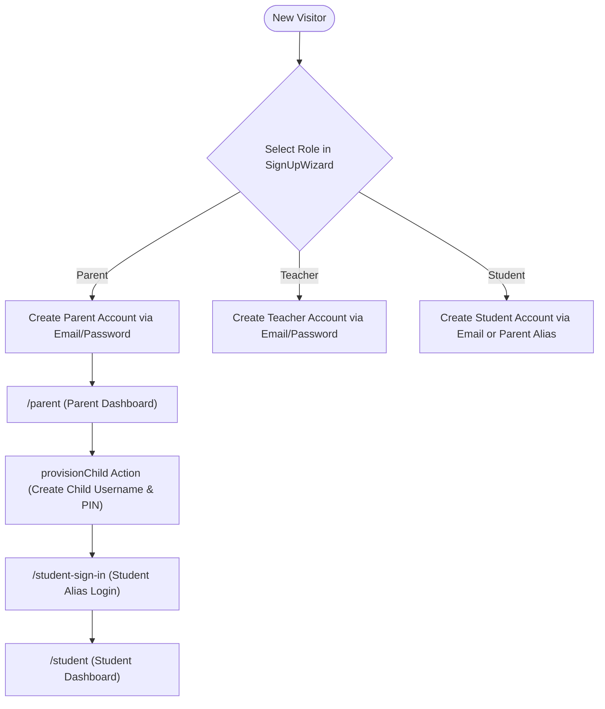

# 03. Authentication and Onboarding Audit

**Audit Date:** 26 August 2026  
**Auditor:** Antigravity  
**Classification:** `COMPLETE` (Auth Plumbing) / `PARTIAL` (Student Guided Onboarding)

---

## 1. Authentication Architecture & Role Model

MindMosaic implements role-based authentication powered by **Supabase Auth** with dedicated profile records in the `profiles` table.



### Role Model (`src/features/auth/roles.ts`)

```typescript
export type UserRole = "student" | "parent" | "teacher" | "admin";

export function roleHomePath(role: UserRole | null): string {
  switch (role) {
    case "parent": return "/parent";
    case "teacher": return "/teacher";
    case "admin": return "/admin";
    case "student":
    default: return "/student";
  }
}
```

---

## 2. Authentication Flows & Screens

| Flow | File / Route | Implementation & Security Controls | Status |
| :--- | :--- | :--- | :--- |
| **Sign Up Wizard** | `src/features/auth/components/SignUpWizard.tsx` (`/sign-up`) | Multi-step role picker with age validation and COPPA/Australian child privacy consent. | `COMPLETE` |
| **Parent & Teacher Login** | `src/features/auth/components/SignInPanel.tsx` (`/sign-in`) | Standard email + password login with show/hide toggle and remember-me option. | `COMPLETE` |
| **Student Alias Login** | `src/app/student-sign-in/page.tsx` | Allows children without real email addresses to sign in using child alias and password/PIN created by parent. | `COMPLETE` |
| **Password Reset** | `src/app/auth/reset/page.tsx` | Supabase `resetPasswordForEmail()` with PKCE exchange and expiry protection. | `COMPLETE` |
| **Email Verification** | `src/app/auth/confirm/page.tsx` | Validates email confirmation tokens and redirects to appropriate role home. | `COMPLETE` |
| **Sign Out** | `useAuth().signOut()` | Clears auth cookies, invalidates Supabase token, and refreshes server component tree. | `COMPLETE` |

---

## 3. Parent-Child Provisioning & Multiple Children

### Provision Child Server Action (`src/features/auth/provision-child.ts`)
* **Security Isolation:** Uses a dedicated service-role admin client scoped strictly to creating the child auth user and inserting the `parent_children` linkage record.
* **Child Alias Generation:** Transforms child name (e.g., "Oliver") into unique scoped alias (`oliver-k492`) so children do not require real email inboxes.
* **Child Year Level:** Sets initial year level (e.g. Year 3 or 5) to dynamically curate catalogue suggestions.
* **Multiple Children:** Parents can link up to 4 children per Family Plan. The parent dashboard provides an instant child switcher (`ChildSelector`) without re-authenticating.

---

## 4. Onboarding Journey Evaluation & Gaps

### What Works Well
* Seamless role distinction during sign-up.
* Parent-governed child credential creation avoids COPPA/privacy issues with children submitting personal emails.
* Clear visual states for email verification pending and password reset expired.

### Critical Onboarding Gap: Missing Student First-Run Orientation
* **Finding:** When a child logs into `/student` for the very first time, they land on a standard dashboard showing empty state counters ("0 sessions finished").
* **Product Risk:** An 8-year-old Grade 3 student lacks context on where to click or what exam style to choose first.
* **Recommendation (Wave 1):** Introduce a **3-step first-run diagnostic modal** (or "Quick 5-Question Warmup") immediately upon first login to determine baseline ability and auto-populate their initial dashboard.
