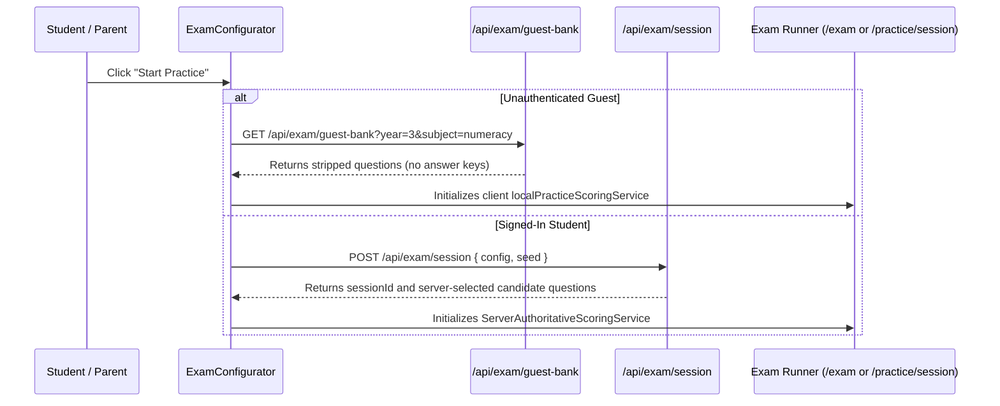

# 04. Assessment Discovery & Configuration Audit

**Audit Date:** 26 August 2026  
**Auditor:** Antigravity  
**Classification:** `COMPLETE` / `VERIFIED`

---

## 1. Practice & Programme Discovery Routes

MindMosaic provides structured entry points for exploring and starting practice sessions:

```text
Discovery Surfaces
├── /assessments            # Primary marketing catalogue for curriculum & exam programs
├── /practice               # Filterable practice catalogue with subject still-life cards
├── /practice/[program]     # Program-specific launch pad (e.g., Grade 3 NAPLAN Numeracy)
├── /exams                  # Full-length exam pattern picker
├── /exams/[patternId]      # Exam simulation launcher with fixed time limits
└── /student/learn          # In-product Learning Hub with strand & skill browser
```

---

## 2. Programme Catalogue Architecture (`src/features/catalogue/catalogue.ts`)

Programmes are defined with explicit metadata, subject scopes, and status indicators:

```typescript
export interface Program {
  id: string;
  name: string;
  slug: string;
  yearLevel: number;
  subject: Subject;
  examStyle: "naplan_style" | "icas_style";
  status: "live" | "coming_soon";
  scope?: {
    yearLevel: YearLevelFilter;
    examStyle: ExamStyleFilter;
    subject: SubjectFilter;
    initialBankId: ExamBankId;
  };
}
```

### Dynamic Coverage Threshold (`src/features/taxonomy/coverage.ts`)
* **Gated Release Logic:** Rather than hardcoding program availability, `resolveProgramStatuses()` counts the eligible items in the question pool.
* A program is marked `"live"` only if its active pool clears `GATED_COVERAGE_THRESHOLD` (e.g. 50 items minimum).
* Expansion cells (Years 2, 4, 6–12, AMC, Olympiads) automatically display `"Coming soon"` badges until sufficient content is ingested.

---

## 3. Practice Configuration (`src/features/exam-engine/components/ExamConfigurator.tsx`)

When launching a session, the student or parent is presented with the **Exam Configurator**, which dynamically calculates eligible questions and duration:

### Configuration Dimensions

1. **Year Level Selection:** Grade 3, Grade 5 (extensible to Years 1–12).
2. **Assessment Style:**
   - **NAPLAN-style:** Focuses on Australian Curriculum numeracy, reading, language conventions, and spelling formats.
   - **ICAS-style:** Emphasizes higher-order critical thinking, digital technologies, and science inquiries.
3. **Subject Selection:** Numeracy, Reading, Language Conventions, Science, Digital Technologies, Spelling, or Mixed Diagnostic.
4. **Question Count Options:**
   - `5 questions` (~8 mins) — Quick warmup
   - `10 questions` (~15 mins) — Standard practice
   - `15 questions` (~25 mins) — Extended drill
   - `20 questions` (~35 mins) — Deep revision
   - `Full paper` (35–45 questions) — Full mock exam
5. **Timing Modes (`TimingMode`):**
   - **Untimed:** Relaxed learning pace (recommended for practice).
   - **Standard (1.0x):** Real exam time allocation.
   - **Extended (1.5x):** Extra time accommodation for developing readers.
   - **Double (2.0x):** Special educational access mode.
6. **Bank Source Toggle:** Allows toggling between Curated Core Bank and Extended Factory Practice Bank.

---

## 4. Session Dispatch: Guest vs Signed-In



---

## 5. UX Assessment: "What Should I Practise Now?"

| Persona | Discovery Ease | Verdict |
| :--- | :--- | :--- |
| **Guest Student** | Can choose Grade 3/5 + Subject and start in **2 clicks**. | **EXCELLENT** |
| **Signed-In Student** | Dashboard highlights active incomplete sessions and recommended weak subject. | **GOOD** (Can improve with 1-click skill drills) |
| **Parent** | Can review weak subject bands and launch a matching practice session for their child. | **GOOD** |
