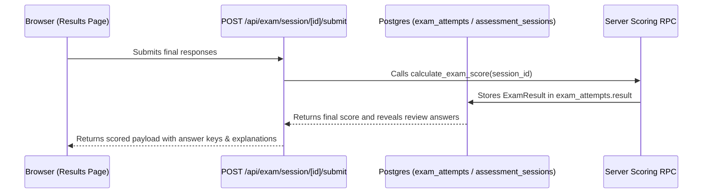

# 06. Results and Explanations Audit

**Audit Date:** 26 August 2026  
**Auditor:** Antigravity  
**Classification:** `COMPLETE` / `HIGH QUALITY`

---

## 1. The Post-Assessment Results Screen (`src/app/results/page.tsx`)

The Results screen provides an encouraging, transparent breakdown of performance immediately following exam submission.

```text
Results Page Structure
├── Header Summary Tile
│   ├── Score Ring (Conic-gradient visual percentage)
│   ├── Marks Breakdown (e.g., 28 / 35 marks earned)
│   ├── Time Taken Meter (e.g., 24 mins 12 secs)
│   └── Performance Band Badge (Strong / Good / Building / Needs Practice)
├── Session Badges Row (Flawless Finish, Speedy Solver, High Accuracy)
├── Subject & Topic Breakdown Cards (Accuracy % per subject)
└── Question-by-Question Detailed Review
    ├── Filter Tabs: [All (35)] [Incorrect (5)] [Flagged (3)] [Unanswered (0)]
    ├── Question Card with Student's Answer vs Correct Answer
    └── Expandable Step-by-Step Worked Explanation Box
```

---

## 2. Worked Explanations & Learner Explanations

### Schema & Content Structure (`src/schemas/question.schema.ts`)
Each question in the bank carries:
1. `explanation`: The comprehensive worked explanation demonstrating the conceptual derivation of the correct answer.
2. `learnerExplanation` (optional/encouraged): A simplified, conversational summary written specifically for Grade 3 or Grade 5 learners.

### Explanation Layout & Quality Standards (`src/features/exam-engine/practice-mode/PracticeSession.tsx` & `src/app/results/page.tsx`)
* **Tone & Framing:** Positive and educational. When an answer is incorrect, the banner reads *"Not quite — here is how to work it out"* rather than punitive phrasing.
* **Supporting Visual Reuse:** Explanations preserve and re-render the question's diagram or chart, highlighting the specific sector, coordinate, or bar referenced in the solution.
* **Maths Formatting:** Renders clear fractions and arithmetic steps without cryptic raw syntax.

---

## 3. Results Persistence & Security Model



* **Anti-Cheating Guarantee:** Prior to clicking Submit, the client browser never receives the answer keys or explanations. Once submitted, the session is locked against further edits (`exam_responses_locked_after_submit.sql`), and the full review payload is securely returned.

---

## 4. Learning Insight Assessment

| Metric | Evaluation | Evidence |
| :--- | :--- | :--- |
| **Score Clarity** | **EXCELLENT** | Clear percentage, points earned, and time spent. |
| **Mistake Review** | **EXCELLENT** | Direct 1-click filter for `Incorrect` questions with full worked answers. |
| **Subject Breakdown** | **GOOD** | Displays subject-by-subject accuracy percentages. |
| **Strand / Skill Insights** | **COMPLETE** | Deterministic recommendation engine (`recommendSkills`) identifies top weakness targets ranked by lost objective marks and accuracy. |
| **Next Action Trigger** | **COMPLETE** | One-click "Practise missed skills" CTA launches a deterministic 5-question drill targeting the identified skill, excluding just-completed items via typed sessionStorage handoff. |

---

## 5. "Practise Missed Skills" Loop Architecture

1. **Recommendation Engine (`recommendSkills`):** Pure deterministic function analyzing `ExamResult` and submitted questions. Filters out manual-review items, groups by subject and skill/topic, and ranks up to 3 weakness targets by lost marks $\rightarrow$ accuracy $\rightarrow$ sample size $\rightarrow$ alphabetical tie-break.
2. **Deterministic Drill Builder (`buildDrill`):** Selects exactly 5 questions from `banks.published`, preferring learner year level and exam style, and excluding prior assessment IDs when sufficient alternatives exist.
3. **Opaque Handoff & SessionStorage:** Results CTA stores a typed `DrillLaunchRequest` (valid for 2 hours) in `sessionStorage` for same-tab navigation and page refresh. Navigation URL contains strictly `/practice/session?mode=drill&launchId=<opaque-id>`, preventing URL parameter tampering.
4. **Pre-Fetch Validation:** The practice route validates the launch record in browser storage before requesting `/api/exam/guest-bank`. Missing, expired, or tampered handoffs immediately render a recoverable error state without downloading answer-bearing question banks.
5. **Honest Insufficiency Reporting:** If fewer than 5 eligible published questions exist, the UI renders an explicit insufficiency state detailing the available count rather than starting an incomplete drill.
6. **Security & Practice Model:** The drill currently inherits the existing client-side guest-practice model (`/api/exam/guest-bank`). Server-scored candidate-only practice remains an intentionally deferred hardening milestone.
