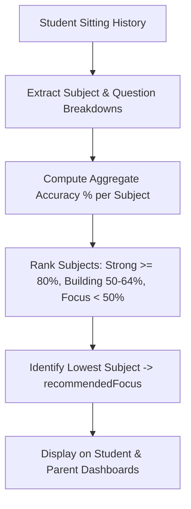

# 09. Personalisation and Analytics Audit

**Audit Date:** 26 August 2026  
**Auditor:** Antigravity  
**Classification:** `PARTIAL` (Solid Data Foundation / Missing Sub-Strand Engine)

---

## 1. Current Personalisation Architecture

MindMosaic currently implements a **Rule-Based Diagnostic Framework** that operates over stored sitting attempts:

### Current Implementation Evidence
* **Student Focus (`src/features/student/attempt-summary.ts`)**:
  - `recommendedFocus`: Scans all subject mastery objects and returns the one with the lowest accuracy percentage.
* **Parent Actions (`src/features/parent-dashboard/summary.ts`)**:
  - `buildRecommendedActions()`: Generates structured action items (e.g., *"Revise Numeracy concepts — accuracy is currently at 48%"*).
* **Readiness Score (`computeReadinessScore`)**:
  - A weighted composite of attempt count, recent attempt scores, and streak frequency.

---

## 2. Data Availability Assessment

The database and session telemetry already track all prerequisite attributes required for fine-grained personalisation:

| Data Field | Availability | Stored Location | Granularity |
| :--- | :--- | :--- | :--- |
| **Question ID & Version** | `YES` | `assessment_session_items.item_version_id` | Question |
| **Subject** | `YES` | `item_versions.subject` | e.g., Numeracy, Reading |
| **Strand / Sub-Strand** | `YES` | `item_versions.strand` | e.g., Number and Algebra |
| **Skill Tag** | `YES` | `item_versions.skill` | e.g., Fractions & Equivalence |
| **Difficulty Band** | `YES` | `item_versions.difficulty` | easy, medium, challenging |
| **Answer Correctness** | `YES` | `assessment_session_responses.is_correct` | Boolean / Partial Marks |
| **Time per Question** | `YES` | `assessment_session_responses.time_taken_ms` | Milliseconds |
| **Error Type** | `PARTIAL` | Distractor schema in question definition | Option chosen |

---

## 3. Post-Assessment Skill Targeting vs Historical Personalisation

### Implemented: Post-Assessment "Practise Missed Skills" Loop
1. **Immediate Session Weakness Targeting (`recommendSkills`):** Pure deterministic function analyzing completed assessment scoring details. Excludes manual-review items, groups by subject and skill/topic, and ranks up to 3 weakness targets by lost objective marks and lowest accuracy.
2. **Deterministic Five-Question Drill Builder (`buildDrill`):** Selects 5 reinforcement questions from `banks.published`, preferring learner year level and exam style, and excluding just-completed items via typed `sessionStorage` handoff (scoped for same-tab navigation and page refresh).
3. **Live Route Integration (`/practice/session`):** Strict opaque parameter contract (`mode=drill&launchId=<id>`), pre-fetch storage validation, honest insufficiency state when fewer than 5 eligible published questions exist, and correct "Back to results" exit navigation.
4. **Learning Hub Skill Gating:** The Skill Browser (`SkillBrowser.tsx`) only exposes skills with at least 5 published questions, defaults to single-subject view, and provides search and pagination.

### Remaining Roadmap (Not Yet Complete)
1. **Cross-Attempt Multi-Sitting Historical Aggregation:** Student and Parent dashboards aggregate historical performance at the **Subject level** from stored `result.breakdowns.bySubject`. Historical multi-attempt sub-strand skill aggregation across past sessions is planned for a future data-pipeline release.
2. **Spaced Repetition & Error Bank:** Dedicated persistent mistake revision decks across months of practice.
3. **Candidate-Only Server Scored Practice:** Practice engine currently inherits the documented guest-bank client-side delivery model (`/api/exam/guest-bank`); candidate-only isolated practice delivery is a separate future hardening project.
