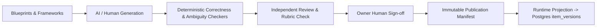

# 10. Content Platform and Coverage Audit

**Audit Date:** 26 August 2026  
**Auditor:** Antigravity  
**Classification:** `PARTIAL` (Architecture Strong / Bank Depth is the #1 Platform Bottleneck)

---

## 1. Active Question Bank Inventory

From the forensic bank audit (`npm run audit:bank` execution against `getExamBank('published')`):

### Overall Bank Statistics

* **Total Active Published Questions:** **1,293**
  - Curated Core Pool (`questionBank`): 1,005 items (77.7%)
  - Factory Published Pool (`batch-published.json`): 288 items (22.3%)

### Distribution by Year Level & Exam Style

| Subject | Year Level | Exam Style | Total Items | Visual Count | Visual % |
| :--- | :--- | :--- | :--- | :--- | :--- |
| **Numeracy** | Year 3 | NAPLAN-style | **150** | 44 | 29.3% |
| **Numeracy** | Year 3 | ICAS-style | **101** | 30 | 29.7% |
| **Science** | Year 3 | ICAS-style | **99** | 30 | 30.3% |
| **Digital Technologies**| Year 3 | ICAS-style | **98** | 22 | 22.4% |
| **Spelling** | Year 3 | ICAS-style | **98** | 0 | 0.0% |
| **Reading** | Year 3 | NAPLAN-style | **97** | 1 | 1.0% |
| **Language Conventions**| Year 3 | NAPLAN-style | **96** | 0 | 0.0% |
| **Language Conventions**| Year 3 | ICAS-style | **94** | 0 | 0.0% |
| **Numeracy** | Year 5 | NAPLAN-style | **91** | 71 | 78.0% |
| **Numeracy** | Year 5 | ICAS-style | **79** | 27 | 34.2% |
| **Reading** | Year 5 | NAPLAN-style | **56** | 9 | 16.1% |
| **Spelling** | Year 5 | ICAS-style | **45** | 0 | 0.0% |
| **Language Conventions**| Year 5 | NAPLAN-style | **40** | 1 | 2.5% |
| **Digital Technologies**| Year 5 | ICAS-style | **35** | 8 | 22.9% |
| **Reading** | Year 5 | ICAS-style | **18** | 0 | 0.0% |
| **Language Conventions**| Year 5 | ICAS-style | **13** | 0 | 0.0% |
| **Writing** | Year 3 / 5 | NAPLAN / ICAS | **4** | 0 | 0.0% |
| **TOTAL** | | | **1,293** | **279** | **21.6%** |

---

## 2. Capacity Analysis & Expansion Needs

From `npm run capacity:report`:

* **Capacity Target:** 50 items minimum per cell (Family × Programme × Year × Subject × Difficulty Band) to guarantee multiple non-repeating exam forms.
* **Cells at or Above Target:** **2** of 219 (0.9%) — Year 3 NAPLAN Numeracy Easy (77 items) and Year 5 NAPLAN Numeracy Medium (52 items).
* **Cells Below Target:** **217** of 219 (99.1%).
* **Content Deficit:** **9,690 items** needed across all planned cells (Years 2–12).
* **Zero Content Areas:** Years 2, 4, 6, 7, 8, 9, 10, 11, 12; Australian Mathematics Competition (AMC); Olympiads; Selective Schools; Victorian Scholarship Preparation; Singapore Maths.

---

## 3. Content Platform v2 Architecture

The Content Platform (`src/features/question-factory/` & `src/features/content-platform/`) implements a governed authoring and publication pipeline:

### Critical Governance Finding: Human Sign-Off Records
* **Forensic Finding:** In the manifest schema and published files, **0 of 1,293 published items carry verifiable `approvedBy` human reviewer signatures**.
* **Authorship vs Approval:** 82 manifests declare a human *author*, but zero carry an independent human *approver* signature.
* **Recommendation:** Update the Content Factory publication gate to mandate a recorded `approvedBy` human reviewer ID before promoting draft JSONs to `publishedExamBank`.

---

## 4. Pragmatic Content Roadmaps

Do not attempt to generate 9,690 questions at once. Follow this focused milestone plan:

1. **Milestone 1 (Core V1 Launch Readiness — 3,000 Questions):**
   - Solidify Year 3 & Year 5 NAPLAN and ICAS pools to 50+ items per difficulty band.
   - Enables 3 full-length non-overlapping mock exam papers per subject.
2. **Milestone 2 (Selective Schools & Year 7 Transition — 1,500 Questions):**
   - Introduce Grade 6 / Year 7 Selective School entry practice (Reading, Numerical Reasoning, Thinking Skills).
3. **Milestone 3 (Competition & Extension — 2,000 Questions):**
   - Introduce AMC (Middle Primary / Upper Primary) and Singapore Maths heuristics.
