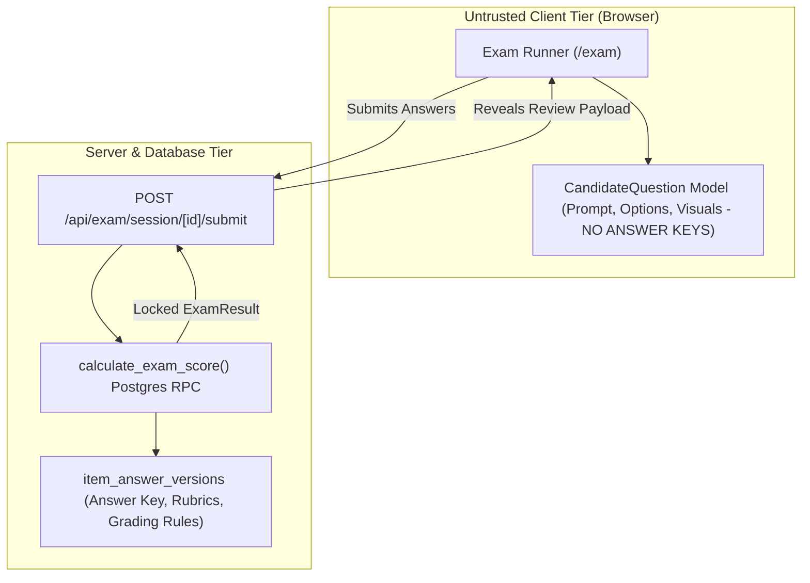

# 13. Security, Reliability and Tests Audit

**Audit Date:** 26 August 2026  
**Auditor:** Antigravity  
**Classification:** `COMPLETE` (Core Security Architecture) / `VERIFIED`

---

## 1. Security & Answer Key Isolation

MindMosaic implements an **Anti-Cheating Answer Isolation Contract** (detailed in `docs/ASSESSMENT_SECURITY_MODEL.md`):

* **Candidate Model:** `toCandidateQuestion()` strips `answerKey`, `explanation`, and `learnerExplanation` before transmitting data to the client.
* **Database Isolation:** Direct `SELECT` access to `item_answer_versions` is revoked from public and authenticated anon roles. Only the Postgres scoring role can access answer keys during runtime scoring.

---

## 2. Row-Level Security (RLS) & Child Privacy

40 database migrations enforce strict row-level tenant isolation:

1. **Student Isolation:** `auth.uid() = student_id`. Students can only view their own sittings, responses, and assignment submissions.
2. **Parent Isolation:** Parents can only query children linked via `parent_children` where `parent_id = auth.uid()`.
3. **Teacher Isolation:** Teachers can only view student submissions for students enrolled in their assigned classes.
4. **Data Retention & Erasure (ADR-012):** Implements `erase_student_both_models()` RPC to permanently delete student PII and session history upon parent erasure request.

---

## 3. Module Boundaries: Scoring vs Publication Architecture

### Defense-in-Depth Module Boundary Guard
* `src/features/content-platform/operator-service.ts` references server-side database configuration. To ensure it cannot be bundled into a client environment, it carries the mandatory `import "server-only";` guard at the top of the file.
* This was a defense-in-depth / static build boundary requirement; the module is only ever referenced by internal scripts (`scripts/mm-content.mts`, `scripts/content-quality-pilots.mts`).

### Separation of Publication Writes from Runtime Scoring (§9.3)
* Per Section 9.3 of `docs/spec/scalable-assessment-platform-spec-v1.md`:
  - **Runtime Scoring Reads:** `src/server/scoring/answer-access.ts` holds the dedicated, least-privilege `mindmosaic_scoring` credential to read `item_answer_versions` during exam grading. It must never export answer keys or take on publication responsibilities.
  - **Publication Writes:** Authorized publication and administration jobs (`operator-service.ts`) write projected content into `item_answer_versions` via `INSERT` statements using separately audited server credentials.
* **Boundary Check Enforcement:** `src/tests/unit/scoring-module-boundary.test.ts` uses an automated SQL classification helper (`classifyItemAnswerVersionsAccess`) to verify that no application file outside `src/server/scoring/answer-access.ts` executes `SELECT` or `JOIN` reads on `item_answer_versions`, while permitting authorized publication `INSERT` statements.

---

## 4. Test Suite Inventory & Coverage

Programmatic scan of test files across the repository:

| Test Directory | File Count | Scope & Focus |
| :--- | :--- | :--- |
| **`src/tests/components/`** | 68 | UI components, modals, shells, landing sections, renderers |
| **`src/tests/pages/`** | 7 | Page-level routing, layouts, and guest/auth redirects |
| **`src/tests/unit/`** | 187 | Question scorers, visual SVG coordinate math, stores, boundaries, schemas |
| **`tests/rls/`** | 29 | PostgreSQL RLS policies, scoring role grants, data erasure RPCs |
| **`e2e/`** | 19 | Playwright end-to-end specifications (A11y, auth, exam flows, smoke) |
| **Total Test Files Across Repository** | **310** | Comprehensive static, unit, integration, and database test coverage |

---

## 5. Offline & Unsaved State Handling

* **In-Memory Client State:** Active exam responses are held in the client Zustand store (`useExamStore`).
* **Server Autosave:** Responses are automatically debounced and autosaved to `POST /api/exam/session/[id]/responses`.
* **Disconnection Behavior:** If network connectivity drops, answers remain in the active browser tab's in-memory store. However, **exam answers are not cached in localStorage**, and a durable offline sync queue does not currently exist. If the student closes or reloads the tab while offline, un-autosaved responses will be lost.
